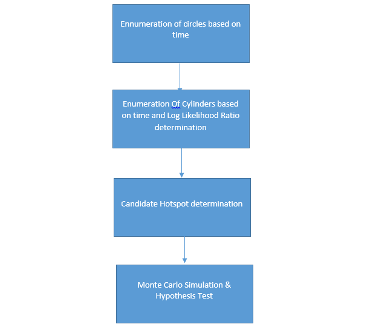

# CylindricalHotspotDetection
Spatio-Temporal Hotspot Detection
### Introduction
Criminology- Crimes are a common social problem affecting the quality of life and the economic growth of a society. It is considered an essential factor that determines whether or not people move to a new city and what places should be avoided when they travel . With the increase of crimes, law enforcement agencies are continuing to demand advanced geographic information systems and new data mining approaches to improve crime analytics and better protect their communities .Hotspots are aggregations of the raw crime data ,designed to identify the sites of highest incident concentration.
Epidemiology - Every year there is some outbreak of disease that affect hundreds of lives. Diseases like dengue, malaria etc. spreads from particular areas where there is lack of hygiene, water logging and several other factors. The importance of “hotspots” in infectious disease epidemiology has been increasingly recognized, and finding hotspots has become an important component of disease-control strategies. Identification of hotspot can be an important factor for resource planning, allocation and response to infectious disease. This can prevent poor allocation of resources and late reaction of officials of concerned departments.

The aim of this project is to successfully implement enhanced satscan algorithms to identify such hotspot areas on the basis data of the geographical coordinates. 
In this paper two approaches have been proposed – 
Approach 1 -For circular spatial hotspot detection 
Approach 2 -For cylindrical spatio-temporal hotspot detection. 

### Comparison with existing approaches
Most of the work that has been done before can generate many false positive despite their high ability to detect hotspots. Another issue is that they may return very small hotspots that occurred by chance (suppose two or more points are exactly at the same location) since they lack a minimum radius Rmin threshold.
Many approaches like Support Vector Machine based , EigenSpot algorithms etc. faces problem of not being able to find multiple hotspots. Other enhanced SatScan algorithms are computationally challenging as the enumeration space of all possible hotspots in the study area is huge and the computational cost of the statistical significance test is high.
The proposed algorithm solves the computationally challenging problem of large enumeration space of all possible hotspots efficiently by first applying the algorithm on different temporal layers separately while guaranteeing correctness and completeness with a given resolution of the discretized parametric space of cylinders. The algorithm was able to discover statistically significant hotspots on real world crime data. We have also considered temporal information. Temporal information is societally meaningful in hotspot detection since it reveals the speed of the diffusion of activities (e.g., disease) and helps in finding emerging hotspots.

### Solution Approach

#### Enhanced Satscan Algorithm - Cylindrical Hotspot Detection

#### Ennumeration of circles based on time 
For each year, we find all the circles that can be formed using points of that year.
#### Enumeration Of Cylinders based on time and Log Likelihood Ratio determination 
For each circle C, LLR is computed. Among the overlapping cylinders generated for a year, only the ones which have the highest log likelihood ratio are stored as the candidateCylinders for each time layer.
#### Candidate Hotspot determination 
Among the overlapping cylinders of all the layers only the ones which have highest LLR are stored as candidateCylinders.
#### Monte Carlo Simulation & Hypothesis Test 
Using Log Likelihood Ratio (LLR) value as test statistic and Monte Carlo array the test significance value (p-value) is determined and compared with threshold value to determine weather a candidate hotspot is significant or not.

### TESTING AND FINDINGS

Enhanced SatScan Algorithm has been tested on Chicago criminal data of 2016 to 2018 and it has identified two potential spatial temporal cylindrical hotspot as can be seen in below figures. 

       

Algorithm for spatial hotspot detection has been tested on crime data of 2015 Chicago and it has identified 2 circular hotspots as can be seen in below figure.

